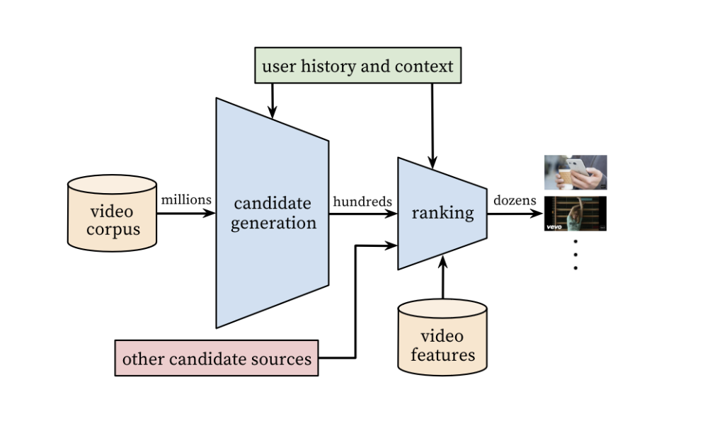
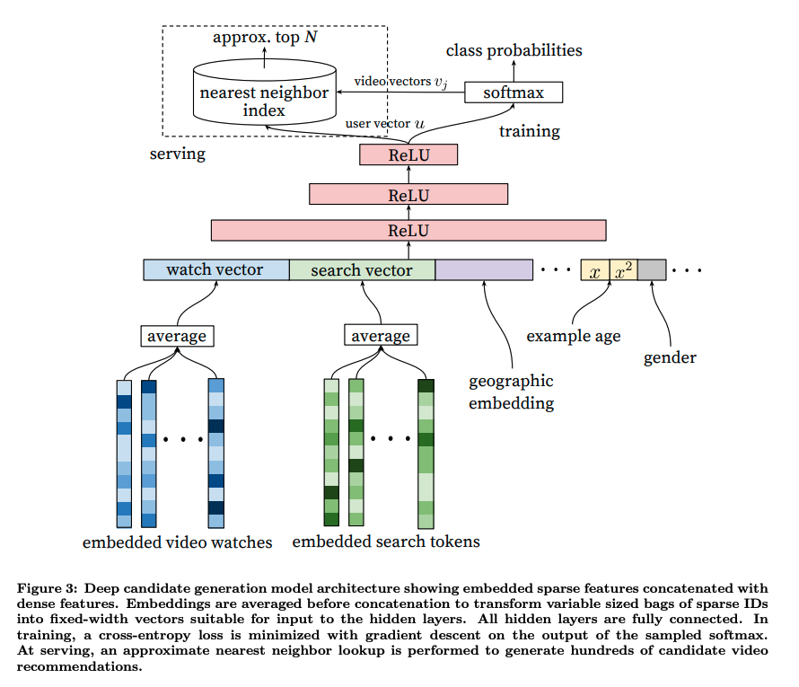
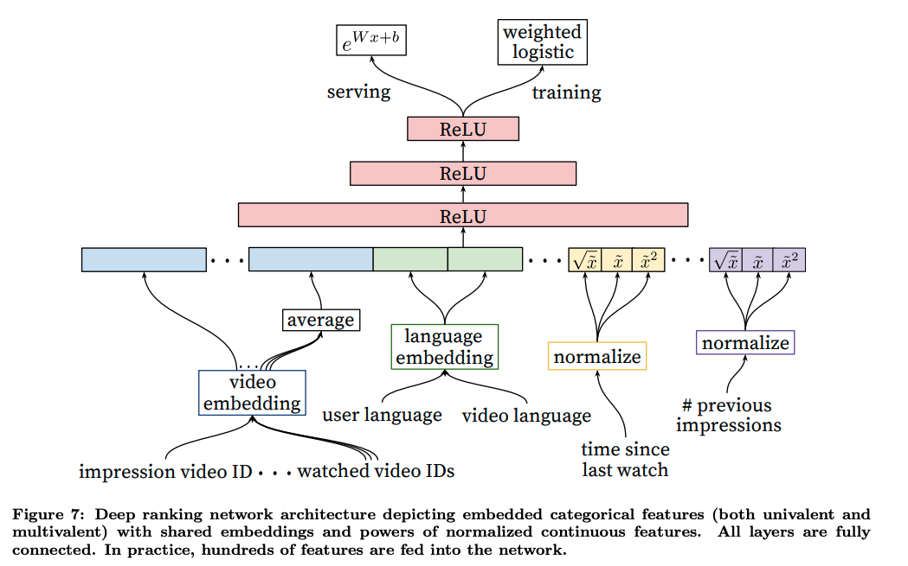

## Overview
This is the python implementation of the paper [Deep Neural Networks for YouTube Recommendations](https://static.googleusercontent.com/media/research.google.com/ja//pubs/archive/45530.pdf).    
The system is comprised of two stages: one for candidate generation and one for ranking

### Candidate Generation 
The candidate generation network takes events from the user's Youtube activity history as input and retrieves a small subset (hundreds) of videos from a large corpus. These candidates are intended to be generally relevant to the user with high precision. 

Treat it as extreme multiclass classification where the prediction problem becomes accurately classifying a specific video watch $w_t$ at time t among millions of videos $i$ (classes) from a corpus $V$ based on a user $U$ and context $C$ 
$$P(w_t = i | U, C) = \frac{e^{v_iu}}{\sum_{j \in V} e^{v_ju}}$$
where $u \in R^{N}$ represents a high-dimensional "embedding" of the user, context pair and the $v_j \in R^{N}$ represent embeddings of each candidate video. 

The task of the deep neural network is to learn user embeddings $u$ as a function of the user's history and context that are useful for discriminating among videos with a softmax classifier. The target is whether a user completing a video. 

- **Training**: To efficiently train such a model with millions of classes, we sample negative classes from background distribution (candidate sampling) and then correct for this sampling via importance weighting.
- **Serving**: We need to compute the most likely N classes (videos) in order to choose the top N to present to user. We need to score millions of items -> nearest neighbor search in the dot product space
- **Features**:  
    - A user’s watch history, search history, demographic features (region, device), gender, logged-in state and age.
    - Example Age (number of days since upload): reflect the freshness of content. At serving time, this feature is set to zero (or slightly negative) to reflect that the model is making predictions at the very end of the training window.  

### Ranking
Use impression data to specialize and calibrate predictions for the particular user interface. For example, a user may watch a given video with high probability generally but is unlikely to click on the specific homepage impression due to the choice of thumbnail image.  During ranking, we have access to many more features describing the video and the user’s relationship to the video because only a few hundred videos are
being scored rather than the millions scored in candidate generation. 

Our goal is to predict expected watch time given training examples that are either positive (the video impression was clicked) or negative (the impression was not clicked). Positive examples are annotated with the amount of time the user spent watching the video. 

So for each candidate from candidate generation, the ranking model estimates the probability of that video being watched. It then sorts the video candidates based on that probability and returns the list to the upstream process. 

#### Model
The model is trained with logistic regression under cross entropy loss. However, the positive (clicked) impressions are weighted by the observed watch time on the video. Negative (unclicked) impressions all receive unit weight. In this way, the odds learned by the logistic regression are $\frac{\sum{T_i}}{N-k}$ where N is the number of training examples, k is the number of positive impressions, and $T_i$ is the watch time of the ith impression. 

For inference, we use the exponential function as the final activation function to produce these odds that closely estimate the watch time.

#### Features
- Binary features: whether the user is logged in
- categorial features: the user's last search query
- The most important signals are those that describe a user's previous interaction with the item itself and other similar items, matching other's experience in ranking ads. 
    
    - As an example, consider the user's past history with the channel that uploaded the video being scored 
        - how many videos has the user watched from this channel?
        - When was the last time the user watched a video on this topic? 
- Embedding Categorical features: 
    - Each unique ID space has a separate embedding with dimension that increases approximately proportional to the logarithm of the number of unique values. 
    - Very large cardinality ID spaces (e.g. video IDs or search query terms) are truncated by including only the top N after sorting based on their frequency in clicked impressions. Out-of-vocabulary are mapped to the zero embeddings. 
    - Categorical features in the same ID space also share underlying embeddings. For example, there exists a single global embedding of video IDs that many distinct features use (video ID of the impression, last video ID watched by the user, video ID that seeded the recommendation)
- Normalizing Continuous Features 
    - Proper normalization of continuous features are critical for convergence. A continuous feature x with distribution f is transformed to $x$ by scaling the values such that the feature is equally distributed in [0, 1) using the cumulative distribution. 